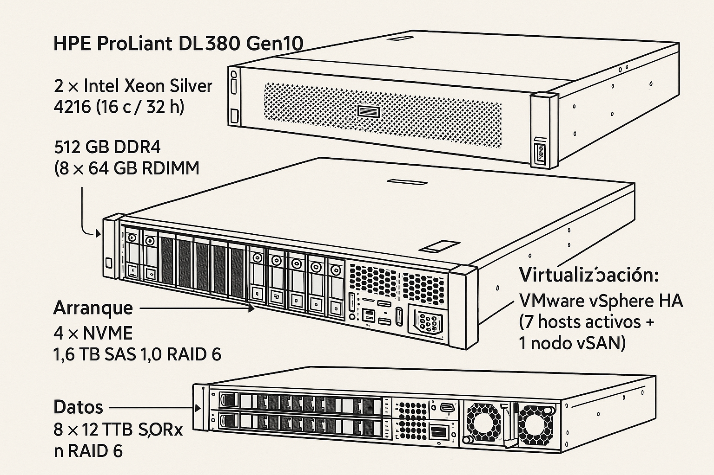
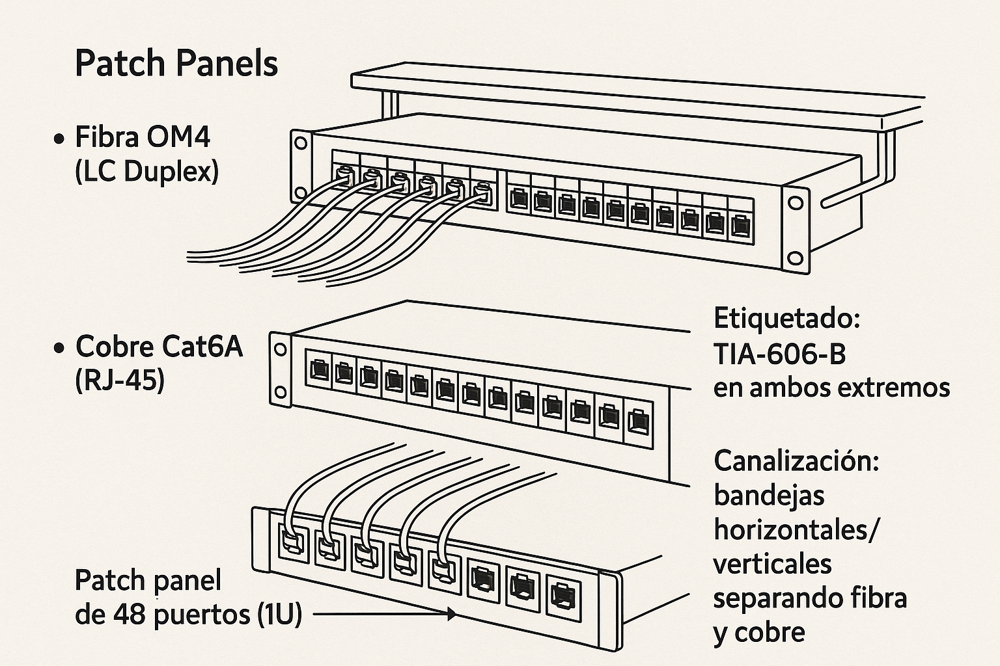
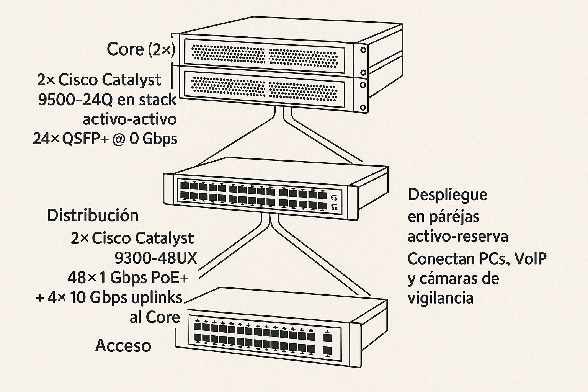
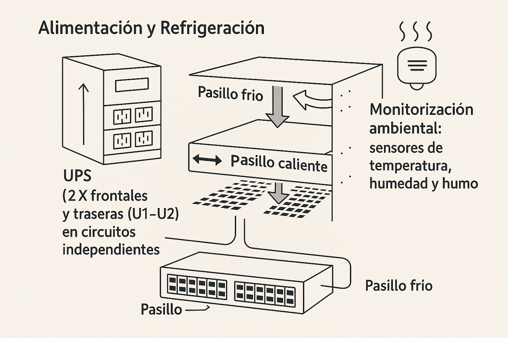

# 🖥️ Infraestructura IT del CPD

## 1. 🖧 Servidores

Tendremos **12 servidores de producción** y **2 de reserva** (política N+1) para asegurar la continuidad:

- 🔹 **Modelo**: HPE ProLiant DL380 Gen10  
- 🔹 **CPU**: 2× Intel Xeon Silver 4216 (16 c / 32 h)  
- 🔹 **RAM**: 512 GB DDR4 (8×64 GB RDIMM)  
- 🔹 **Arranque**: 4× NVMe 1,6 TB en RAID 1+0  
- 🔹 **Datos**: 8× SAS 12 TB @ 10 000 rpm en RAID 6  
- 🔹 **Virtualización**: VMware vSphere HA (7 hosts activos + 1 nodo vSAN)  
- 🔹 **Redundancia**: migración automática de VM si un host falla

**Funcionamiento**  
1. Cada servidor arranca en milisegundos desde NVMe y monta las VM y bases de datos sobre los discos SAS.  
2. El hipervisor ESXi monitoriza la salud de cada nodo; ante un fallo realiza **fail-over** en < 10 s.  
3. El almacenamiento distribuido vSAN replica bloques en múltiples nodos, garantizando tolerancia a pérdidas de disco o servidor.

  

---

## 2. 🧩 Patch Panels

Agrupan y organizan todos los enlaces de fibra y cobre:

- 🔌 **Fibra OM4 (LC Duplex)**  
  - Patch panel de 12 fibras (U5)  
  - Troncales de 4× 10 Gbps a switches de distribución  
- 🔌 **Cobre Cat6A (RJ-45)**  
  - Patch panel de 48 puertos (U6)  
  - Conexiones de gestión, consola y enlaces de respaldo (1 Gbps)  
- 🔌 **Etiquetado**: TIA-606-B en ambos extremos  
- 🔌 **Canalización**: bandejas horizontales/verticales separando fibra y cobre

**Conexión típica**  

  

---

## 3. 🌐 Switches

**Arquitectura en tres capas** para máxima resiliencia y rendimiento:

1. **Core (U5)**  
   - 2× Cisco Catalyst 9500–24Q en stack activo-activo  
   - 24× QSFP+ @ 40 Gbps  
   - LACP (agregación) + VRRP (gateway redundante)

2. **Distribución (U7)**  
   - 2× Cisco Catalyst 9300–48UX  
   - 48× 1 Gbps PoE+ + 4× 10 Gbps uplinks al Core  
   - ACLs para aislar VLANs; QoS para priorizar VoIP/ERP

3. **Acceso**  
   - ~160× Cisco Catalyst 9200–24P (1 Gbps) en armarios de planta  
   - Despliegue en parejas activo-reserva  
   - Conectan PCs, VoIP y cámaras de vigilancia

**Topología de tráfico**  

  

---

## 4. 🔌 Alimentación y Refrigeración

- 🔋 **UPS N+1** (2 kVA módulos intercambiables en caliente, U22–U24)  
- 🔌 **PDU frontales y traseras** (U1–U2), en circuitos independientes  
- ❄️ **Pasillo frío/pasillo caliente**:  
  - Frío entra por el frente; caliente sale por detrás  
  - Rejillas en suelo técnico (40 cm) y techo falso dirigen el aire  
- 🌡️ **Monitorización ambiental**: sensores de temperatura, humedad y humo conectados a BMS con alertas SMS/Email

  

---

## 5. 🗄️ Diseño de Racks del CPD (2× 42U)

El centro de procesamiento de datos contará con **dos racks de 42U** cuidadosamente organizados para asegurar eficiencia operativa, redundancia y escalabilidad. A continuación, se detalla la distribución y funciones de cada uno:

---

### 🔹 Rack 1 – Infraestructura principal

Este rack alberga los elementos esenciales de conectividad, computación y distribución.

| Altura (U)   | Elemento                                 | Función principal                                      |
|--------------|-------------------------------------------|--------------------------------------------------------|
| U1–U2        | PDU frontales y traseras                 | Alimentación redundante en circuitos separados         |
| U3–U4        | Bandejas de gestión de cableado          | Organización y separación de cableado fibra/cobre      |
| U5           | Patch panel fibra OM4 (LC Duplex)        | Troncales de fibra a switches de distribución          |
| U6           | Patch panel cobre Cat6A (RJ-45)          | Consolas, gestión y enlaces de respaldo (1 Gbps)       |
| U7           | Switches de distribución (Cisco 9300)    | Conexión con Core, VLANs, ACL, QoS                     |
| U8           | Bandejas horizontales                    | Canalización de cables                                 |
| U9–U18       | 10× Servidores de producción + vSAN      | Hosts activos ESXi + nodo vSAN                         |
| U19–U20      | 2× Servidores de reserva (N+1)           | Redundancia ante fallo físico                          |
| U21          | Switch de acceso (Cisco 9200)            | Uplinks a planta: PCs, VoIP, cámaras, etc.             |
| U22–U24      | UPS modulares 2 kVA (N+1)                | Respaldo energético continuo                           |
| U25          | Consola KVM                              | Administración local de los equipos                    |
| U26–U42      | Espacio libre para ampliaciones futuras  | Preparado para crecimiento de infraestructura          |

---

### 🔹 Rack 2 – Redundancia y expansión

Este rack proporciona capacidad adicional para failover, carga futura y distribución física optimizada.

| Altura (U)   | Elemento                                 | Función principal                                      |
|--------------|-------------------------------------------|--------------------------------------------------------|
| U1–U2        | PDU frontales y traseras                 | Redundancia energética en segundo circuito             |
| U3–U4        | Bandejas de gestión de cableado          | Organización eficiente de cableado                     |
| U5           | Patch panel fibra OM4 (respaldo)         | Enlaces redundantes de fibra                           |
| U6           | Patch panel cobre Cat6A (respaldo)       | Puertos auxiliares y gestión                           |
| U7–U8        | 2× Servidores de reserva (extra)         | Alta disponibilidad adicional                          |
| U9–U18       | Espacio para 10× servidores nuevos       | Capacidad para expansión futura de cómputo             |
| U19–U20      | Switch de acceso (Cisco 9200)            | Segundo switch de planta (activo/pasivo)               |
| U21–U25      | Espacio libre                            | Uso futuro: backup, GPU, almacenamiento, etc.          |
| U26–U42      | Ampliaciones                             | Preparado para nuevos módulos o clusters               |

---

### 🧩 Consideraciones generales

- **Separación física de funciones:** Red y cómputo organizados para evitar interferencias.
- **Gestión térmica eficiente:** Diseño en pasillo frío/pasillo caliente.
- **Redundancia N+1:** Garantiza continuidad operativa ante fallos.
- **Preparado para el crecimiento:** 30% del espacio está reservado para ampliaciones.

  

