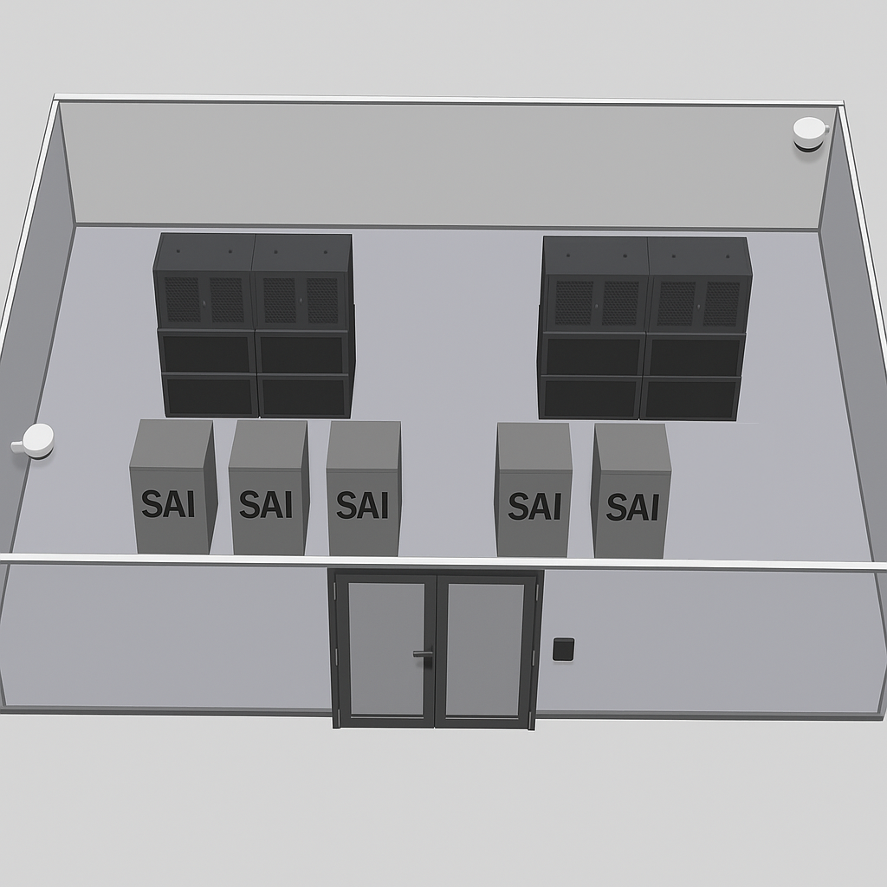

# ⚡ Alimentació elèctrica resilient al CPD

## 1. 🔋 Sistemes SAI (UPS) amb redundància N+1

El **Data Center** està dissenyat per mantenir el servei actiu **en tot moment**, fins i tot en cas de tall elèctric o fallada d’algun component. Per aconseguir-ho, es fa ús de:

- 🧱 **Configuració N+1**: sempre hi ha un mòdul extra preparat per actuar si algun altre falla.
- 🔌 **Potència per unitat**: 2 kVA, amb **factor de potència** del 90% → 1,8 kW reals.
- 🔁 **Hot-swappable**: es poden substituir sense aturar el sistema.
- 📍 **Ubicació**: entre les unitats **U22 i U24** dels racks.
- 🔌 **Distribució dual de potència (PDU)**:
  - U1–U2: dues línies independents, una al davant i una al darrere.
  - Connectades a **circuits separats** per garantir redundància total.

🧠 **Resultat**: Si falla una font o línia elèctrica, **el sistema segueix funcionant sense interrupció**.

---

## 2. 🧮 Càlcul per garantir autonomia de 3 hores

Per assegurar-nos que els servidors poden funcionar **mínim 3 hores** sense electricitat externa, es fa el càlcul següent:

### 🔢 Dades tècniques:

- 🖥️ **Nombre total de servidors**: 14 (12 operatius + 2 de reserva)
- ⚡ **Consum per servidor**: 500 W
- 🔋 **Potència total necessària**:  
  `14 × 500 W = 7.000 W = 7 kW`
- 🔋 **Energia per 3 hores**:  
  `7 kW × 3 h = 21 kWh`

### 🔢 Capacitat dels SAI:

- **Potència efectiva per unitat**:  
  `2 kVA × 0,9 = 1,8 kW`
- **Energia que dona cada UPS en 3 hores**:  
  `1,8 kW × 3 h = 5,4 kWh`
- **UPS necessaris per cobrir 21 kWh**:  
  `21 kWh / 5,4 kWh ≈ 3,89 → 4 unitats`
- ➕ **Amb redundància N+1**:  
  `4 + 1 = 5 UPS`
  Captura de pantalla de 2025-05-20 12-28-50.png
Así es como se verà con los 5 SAI instalados:

  

---

## 3. ✅ Sistema escollit

🎯 El model triat que compleix tots els requisits és:

- 🏷️ **PowerWalker 2000VA / 1800W**
- 📦 **Característiques clau**:
  - Potència: 2 kVA
  - Potència útil: 1,8 kW (factor de potència 0,9)
  - Ideal per escenaris de 3 hores d’autonomia

### 💰 Cost estimat:

- 💸 Preu per unitat: **460,95 €**
- 🔢 Total per 5 unitats:  
  `460,95 € × 5 =` **2.304,75 €**

  

  

---
  </a>

